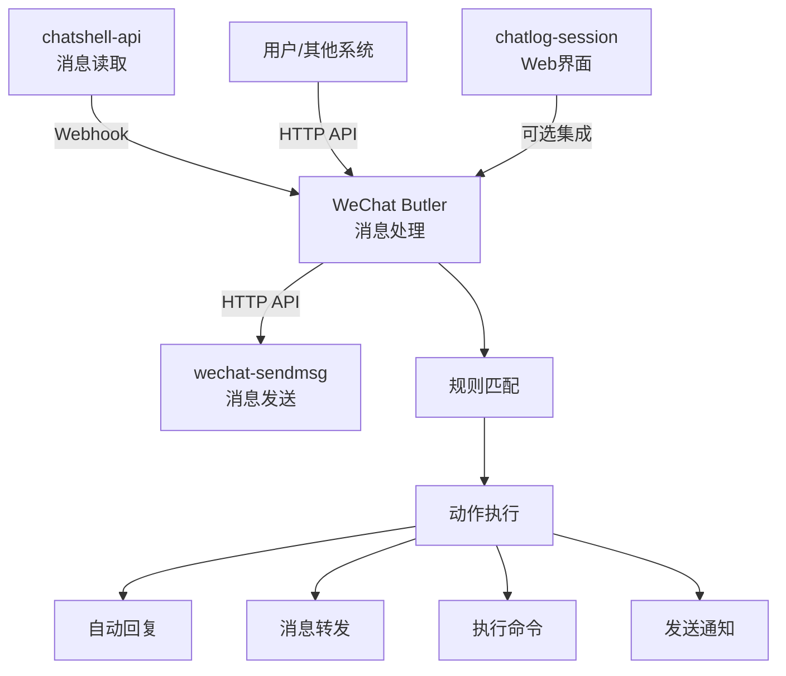

# WeChat Butler 项目文档中心

欢迎来到 WeChat Butler 的文档中心！这里包含了项目的所有技术文档、用户指南和开发资料。

## 📚 文档导航

### v0.1.0 AI Service Layer（当前版本）

- [AI Service 架构设计](architecture/ai-service-v0.1.md) - v0.1.0 架构、数据流、模块设计
- [AI Service API 参考](api/ai-service-api.md) - v0.1.0 全部 API 端点文档
- [技术选型与决策](features/ai-service-tech-decisions.md) - v0.1.0 技术选型理由和设计决策
- [AI Service 快速开始](guides/ai-service-quick-start.md) - 安装、配置、启动、验证

### v0.2.0 全功能版（规划中）

### 🗺️ 项目概述
- [项目介绍](README.md) - 本文件，项目整体介绍
- [技术架构](architecture/overview.md) - 系统架构设计
- [开发路线图](architecture/roadmap.md) - 项目开发计划

### 🚀 快速开始
- [5分钟快速开始](guides/quick-start.md) - 快速安装和配置
- [规则配置指南](guides/rules-configuration.md) - 规则系统使用说明

### 👥 用户指南
- [用户使用手册](guides/user-guide.md) - 完整的用户使用说明
- [规则编写指南](guides/rule-writing.md) - 如何编写有效的规则

### 💻 开发指南
- [开发者指南](guides/developer-guide.md) - 开发环境搭建和开发流程
- [API 集成指南](guides/api-integration.md) - 与其他系统集成方法

### 🔌 API 文档
- [API 参考手册](api/reference.md) - 完整的 API 接口文档
- [Webhook 接口](api/webhook.md) - Webhook 消息接收接口
- [规则管理 API](api/rules.md) - 规则管理接口

### ⚡ 功能特性
- [规则引擎详解](features/rule-engine.md) - 规则系统技术实现
- [动作执行器](features/action-executor.md) - 动作执行系统说明
- [LLM 集成](features/llm-integration.md) - AI 智能回复功能
- [系统集成](features/system-integration.md) - 与现有系统集成方案

### 🏗️ 架构设计
- [系统架构](architecture/overview.md) - 整体架构设计
- [组件设计](architecture/components.md) - 核心组件设计
- [数据流设计](architecture/data-flow.md) - 消息处理流程

### 📝 部署运维
- [安装部署](guides/deployment.md) - 系统安装和部署指南
- [监控维护](guides/monitoring.md) - 系统监控和维护
- [故障排查](guides/troubleshooting.md) - 常见问题解决方案

## 🎯 项目简介

**WeChat Butler** 是一个运行在个人电脑或 mini 设备上的超轻量微信消息自动化工具。它就像一个"智能管家"，帮你自动处理微信消息。

### 核心特点
- ⚡ **超轻量**: 单进程，内存占用 < 50MB
- 🚀 **快速启动**: 秒级启动，即时响应
- 📦 **零依赖**: 除了必要的微信工具，无外部依赖
- 🔧 **简单配置**: 一个配置文件搞定所有设置
- 🖥️ **低资源**: 适合树莓派等 mini 设备

### 主要功能
1. **消息自动化处理**: 接收 chatshell-api 的 webhook，自动处理新消息
2. **智能规则引擎**: 基于关键词、正则表达式等条件触发动作
3. **多种动作支持**: 自动回复、消息转发、执行命令、发送通知等
4. **LLM 集成**: 可选集成 AI 模型进行智能回复
5. **简单控制接口**: 提供 HTTP API 进行外部控制

### 系统集成
WeChat Butler 与现有微信生态工具无缝集成：



## 📁 目录结构

```
wechat-butler/
├── README.md                    # 本文件
├── architecture/                # 架构设计文档
│   ├── overview.md             # 系统架构
│   ├── roadmap.md              # 开发路线图
│   ├── components.md           # 组件设计
│   └── data-flow.md            # 数据流设计
├── features/                    # 功能特性文档
│   ├── rule-engine.md          # 规则引擎
│   ├── action-executor.md      # 动作执行器
│   ├── llm-integration.md      # LLM 集成
│   └── system-integration.md   # 系统集成
├── guides/                      # 指南文档
│   ├── quick-start.md          # 快速开始
│   ├── user-guide.md           # 用户指南
│   ├── developer-guide.md      # 开发指南
│   ├── deployment.md           # 部署指南
│   ├── monitoring.md           # 监控维护
│   └── troubleshooting.md      # 故障排查
├── api/                         # API 文档
│   ├── reference.md            # API 参考
│   ├── webhook.md              # Webhook 接口
│   └── rules.md                # 规则管理 API
└── examples/                    # 示例文件
    ├── config.yaml             # 配置示例
    ├── rules/                  # 规则示例
    │   ├── basic.yaml         # 基础规则
    │   ├── advanced.yaml      # 高级规则
    │   └── llm.yaml           # LLM 规则
    └── scripts/               # 脚本示例
        ├── custom-action.py   # 自定义动作
        └── health-check.sh    # 健康检查脚本
```

## 🛠️ 技术栈

### 核心实现
- **编程语言**: Python 3.11+
- **Web 框架**: FastAPI (轻量级、高性能)
- **配置管理**: YAML 配置文件
- **规则引擎**: 自定义轻量级引擎
- **日志系统**: Python logging

### 可选组件
- **LLM 集成**: OpenAI API / Claude API / DeepSeek API
- **数据库**: SQLite (用于规则持久化，可选)
- **前端界面**: HTML+js (可选管理界面)

### 部署方式
- **直接运行**: Python 脚本直接执行
- **系统服务**: systemd / supervisor 托管
- **Docker**: 容器化部署 (可选)

## 🚀 快速开始体验

### 1. 安装依赖
```bash
pip install fastapi uvicorn pyyaml requests
```

### 2. 基础配置
```yaml
# config.yaml
server:
  host: "0.0.0.0"
  port: 8080

webhook:
  secret: "your-secret"

wechat:
  sendmsg_url: "http://localhost:8000"
```

### 3. 简单规则
```yaml
# rules/basic.yaml
rules:
  - name: "自动问候"
    conditions:
      - type: "keyword"
        value: ["你好", "hello"]
    actions:
      - type: "reply"
        content: "你好！我是自动回复助手。"
```

### 4. 启动服务
```bash
python main.py
```

## 📊 性能指标

### 资源占用
- **内存**: 30-50 MB (基础运行)
- **CPU**: < 5% (空闲时)
- **启动时间**: < 2 秒
- **消息处理延迟**: < 100ms

### 处理能力
- **并发处理**: 支持 100+ 并发消息
- **规则数量**: 支持 1000+ 条规则
- **响应时间**: 平均 50ms 内响应

## 🔄 版本历史

### v0.1.0 (计划中)
- ✅ Webhook 消息接收
- ✅ 基础规则引擎
- ✅ 自动回复功能
- ✅ HTTP API 接口

### v0.2.0 (计划中)
- 🔄 正则表达式支持
- 🔄 消息转发功能
- 🔄 系统命令执行
- 🔄 规则导入/导出

### v0.3.0 (计划中)
- 🤖 LLM 智能回复
- 📊 规则统计和监控
- 🖥️ Web 管理界面
- 🔧 插件系统

## 🤝 参与贡献

欢迎对项目感兴趣的朋友一起参与开发！

### 贡献方式
1. **报告问题**: 发现 bug 或有功能建议
2. **提交代码**: 修复问题或实现新功能
3. **完善文档**: 改进文档或添加示例
4. **测试反馈**: 测试新功能并提供反馈

### 开发规范
- 代码风格遵循 PEP 8
- 提交信息使用约定式提交
- 新功能需要包含测试用例
- 文档更新与代码变更同步

## 📧 联系方式

- **项目仓库**: [GitHub](https://github.com/xlight/wechat-butler)
- **问题反馈**: [Issues](https://github.com/xlight/wechat-butler/issues)
- **讨论交流**: QQ 群 / Discord

---

**最后更新**: 2025-11-22
**文档版本**: v1.0.0
**维护者**: Development Team
