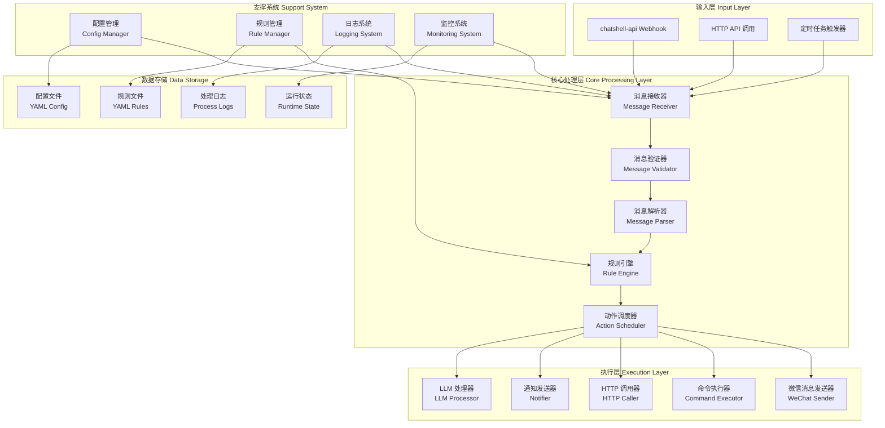
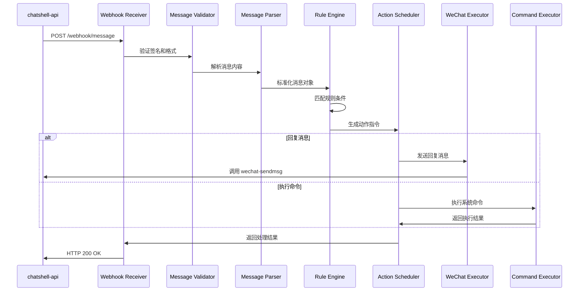
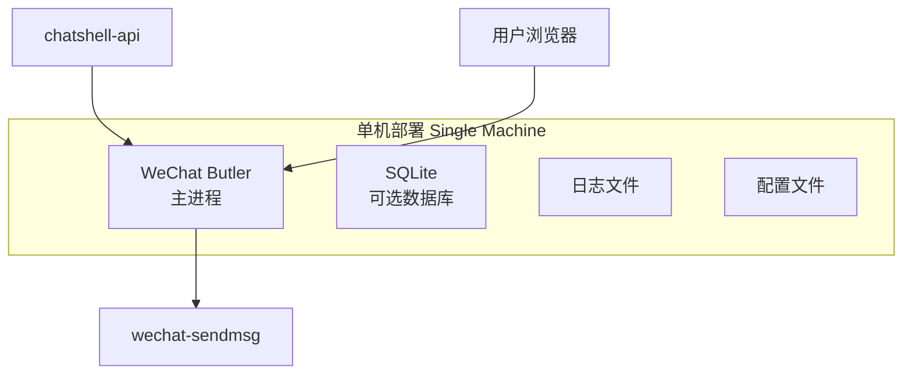
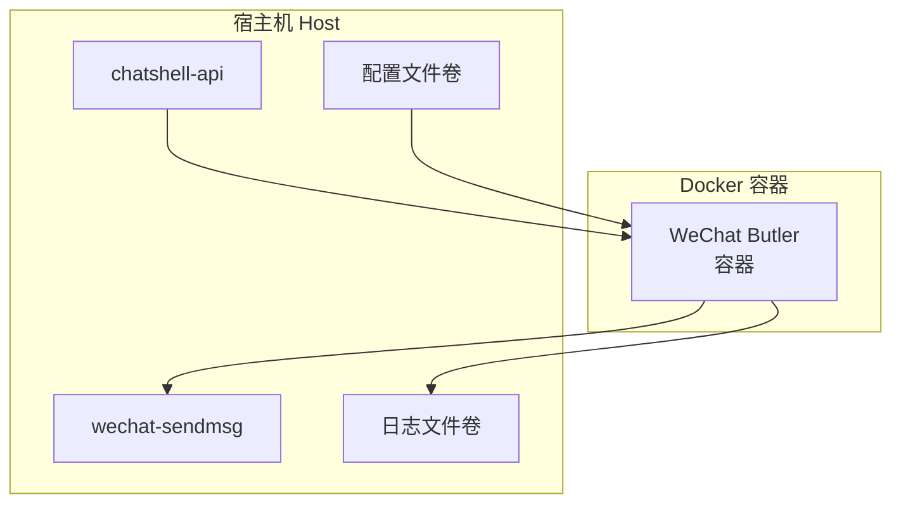

# WeChat Butler 系统架构设计

## 文档信息

- **版本**: v1.0.0
- **创建日期**: 2025-11-22
- **最后更新**: 2025-11-22
- **维护者**: 架构设计团队

---

## 📋 目录

- [设计原则](#设计原则)
- [整体架构](#整体架构)
- [核心组件](#核心组件)
- [数据流设计](#数据流设计)
- [部署架构](#部署架构)
- [扩展性设计](#扩展性设计)
- [安全性设计](#安全性设计)

---

## 设计原则

### 1. 轻量化原则
- **单进程架构**: 避免复杂的微服务拆分
- **最小依赖**: 只引入必要的第三方库
- **低资源占用**: 内存 < 50MB，CPU 占用 < 5%
- **快速启动**: 启动时间 < 2 秒

### 2. 简单性原则
- **配置简单**: 一个 YAML 文件搞定所有配置
- **规则易懂**: 使用声明式规则配置
- **部署便捷**: 支持多种部署方式
- **维护容易**: 日志清晰，问题定位简单

### 3. 可靠性原则
- **异常恢复**: 自动重启和错误恢复
- **消息可靠**: 至少一次消息处理保证
- **配置验证**: 启动时验证配置有效性
- **健康检查**: 提供健康检查接口

### 4. 扩展性原则
- **插件化设计**: 支持自定义动作和条件
- **模块化架构**: 组件之间松耦合
- **配置热重载**: 支持规则和配置热更新
- **API 开放**: 提供完整的 HTTP API

---

## 整体架构

### 架构图



### 架构特点

1. **分层设计**: 清晰的输入-处理-输出分层
2. **组件化**: 每个组件职责单一，易于测试和维护
3. **数据驱动**: 配置和规则驱动系统行为
4. **异步处理**: 支持异步消息处理，提高吞吐量
5. **可观测性**: 完善的日志和监控支持

---

## 核心组件

### 1. 消息接收器 (Message Receiver)
**职责**: 接收来自各种渠道的消息输入
- **Webhook 接收**: 处理 chatshell-api 的 webhook 请求
- **HTTP API**: 提供 RESTful API 接收消息
- **定时触发器**: 支持定时任务触发
- **消息队列**: 可选的消息队列集成

**关键技术**:
- FastAPI Web 框架
- Webhook 签名验证
- 请求限流和防抖

### 2. 消息解析器 (Message Parser)
**职责**: 解析和标准化消息格式
- **格式转换**: 将不同来源的消息转换为统一格式
- **字段提取**: 提取消息中的关键字段
- **内容预处理**: 清理和预处理消息内容
- **类型识别**: 识别消息类型（文本、图片、文件等）

**输出格式**:
```python
{
    "id": "msg_123456",
    "timestamp": 1732252800,
    "talker": "filehelper",
    "sender": "user123",
    "content": "Hello World",
    "type": "text",
    "raw": {...}
}
```

### 3. 规则引擎 (Rule Engine)
**职责**: 根据规则匹配消息并触发动作
- **条件匹配**: 支持多种条件类型（关键词、正则、LLM等）
- **规则评估**: 按优先级评估规则
- **动作生成**: 根据匹配的规则生成动作指令
- **上下文管理**: 维护消息处理上下文

**规则格式**:
```yaml
rules:
  - name: "关键词回复"
    priority: 100
    conditions:
      - type: "keyword"
        field: "content"
        value: ["帮助", "help"]
    actions:
      - type: "reply"
        content: "请问需要什么帮助？"
```

### 4. 动作调度器 (Action Scheduler)
**职责**: 调度和执行具体动作
- **动作分发**: 将动作分发给对应的执行器
- **执行控制**: 控制动作执行顺序和并发
- **错误处理**: 处理动作执行失败的情况
- **结果收集**: 收集动作执行结果

**支持的动作类型**:
- `reply`: 回复微信消息
- `forward`: 转发消息
- `command`: 执行系统命令
- `http`: 调用 HTTP API
- `notify`: 发送系统通知
- `llm`: 调用 LLM 处理

### 5. 执行器组件 (Executors)
**职责**: 执行具体的动作

#### 5.1 微信消息发送器
- 集成 wechat-sendmsg 发送消息
- 支持文本、图片、文件等类型
- 处理发送失败重试

#### 5.2 命令执行器
- 执行系统命令和脚本
- 支持超时控制和输出捕获
- 安全沙箱执行

#### 5.3 HTTP 调用器
- 调用外部 HTTP API
- 支持认证和重试
- 处理响应数据

#### 5.4 LLM 处理器
- 集成多种 LLM 服务商
- 提示词管理和优化
- 响应缓存和限流

### 6. 支撑系统 (Support System)

#### 6.1 配置管理
- YAML 配置文件解析
- 配置验证和默认值
- 配置热重载支持

#### 6.2 规则管理
- 规则文件加载和解析
- 规则验证和编译
- 规则热更新支持

#### 6.3 日志系统
- 结构化日志输出
- 日志级别控制
- 日志文件轮转

#### 6.4 监控系统
- 性能指标收集
- 健康检查接口
- 告警规则配置

---

## 数据流设计

### 消息处理流程



### 详细步骤

1. **接收阶段**
   - Webhook 接收器验证请求签名
   - 解析 JSON 请求体
   - 转换为内部消息格式

2. **处理阶段**
   - 消息验证器检查必填字段
   - 消息解析器提取关键信息
   - 规则引擎匹配适用规则
   - 生成对应的动作指令

3. **执行阶段**
   - 动作调度器分发动作
   - 执行器执行具体操作
   - 收集执行结果和日志

4. **反馈阶段**
   - 更新处理状态
   - 记录处理日志
   - 返回处理结果

---

## 部署架构

### 单机部署模式



**特点**:
- 所有组件运行在同一个进程中
- 使用文件系统存储配置和规则
- 可选 SQLite 用于状态持久化
- 适合个人电脑和 mini 设备

### 容器化部署模式



**特点**:
- Docker 容器封装所有依赖
- 卷挂载配置和日志文件
- 支持快速部署和升级
- 适合生产环境部署

### 系统服务部署

```ini
# systemd 服务配置示例
[Unit]
Description=WeChat Butler Service
After=network.target

[Service]
Type=simple
User=wechat
WorkingDirectory=/opt/wechat-butler
ExecStart=/usr/bin/python3 main.py
Restart=always
RestartSec=10

[Install]
WantedBy=multi-user.target
```

---

## 扩展性设计

### 1. 插件系统设计

```python
# 插件接口定义
class ActionPlugin:
    """动作插件基类"""
    def execute(self, context: dict) -> dict:
        """执行动作"""
        pass
    
    def validate(self, config: dict) -> bool:
        """验证配置"""
        pass

class ConditionPlugin:
    """条件插件基类"""
    def evaluate(self, message: dict, config: dict) -> bool:
        """评估条件"""
        pass
```

### 2. 配置热重载
- 监控配置文件变化
- 安全重载配置和规则
- 保持现有连接和状态
- 提供重载状态反馈

### 3. API 扩展
- RESTful API 设计
- 版本化 API 路径
- OpenAPI 文档自动生成
- 认证和授权支持

### 4. 存储扩展
- 文件系统存储（默认）
- SQLite 数据库（可选）
- Redis 缓存（可选）
- 外部数据库支持

---

## 安全性设计

### 1. 认证授权
- **Webhook 签名**: HMAC-SHA256 签名验证
- **API 密钥**: 简单的 API 密钥认证
- **IP 白名单**: 可配置的 IP 访问控制
- **速率限制**: 防止暴力请求

### 2. 数据安全
- **配置加密**: 敏感配置字段加密存储
- **日志脱敏**: 自动脱敏敏感信息
- **命令沙箱**: 系统命令执行隔离
- **输入验证**: 严格的输入数据验证

### 3. 网络安全
- **HTTPS 支持**: 支持 TLS 加密传输
- **CORS 配置**: 可配置的跨域策略
- **请求过滤**: 防止常见 Web 攻击
- **连接限制**: 防止连接耗尽

### 4. 运行时安全
- **权限最小化**: 以非特权用户运行
- **资源限制**: CPU、内存使用限制
- **文件权限**: 严格的文件系统权限
- **进程隔离**: 可选容器化隔离

---

## 性能考虑

### 1. 内存优化
- 使用生成器处理大消息
- 对象池复用常用对象
- 延迟加载大型资源
- 定期清理缓存数据

### 2. CPU 优化
- 异步 I/O 操作
- 并发处理消息
- 规则编译缓存
- 热点代码优化

### 3. I/O 优化
- 批量文件操作
- 连接池复用
- 缓存常用数据
- 异步日志写入

### 4. 网络优化
- HTTP 连接保持
- 请求压缩
- DNS 缓存
- 超时和重试策略

---

## 监控和运维

### 1. 健康检查
```bash
# 健康检查接口
curl http://localhost:8080/health

# 响应示例
{
  "status": "healthy",
  "version": "1.0.0",
  "uptime": 3600,
  "memory_usage": "45MB",
  "processed_messages": 1234
}
```

### 2. 性能指标
- 消息处理延迟
- 规则匹配耗时
- 动作执行成功率
- 系统资源使用率

### 3. 日志系统
- 结构化 JSON 日志
- 按组件分级日志
- 日志文件轮转
- 关键操作审计

### 4. 告警规则
- 服务不可用告警
- 处理延迟告警
- 错误率告警
- 资源使用告警

---

## 总结

WeChat Butler 采用轻量化、模块化的架构设计，在保证功能完整性的同时，最大限度地降低了系统复杂度和资源消耗。通过清晰的组件划分和简单的配置方式，使得系统易于理解、部署和维护。

架构设计充分考虑了个人使用场景的特点，在扩展性、安全性和性能之间取得了良好的平衡，为后续的功能演进奠定了坚实的基础。