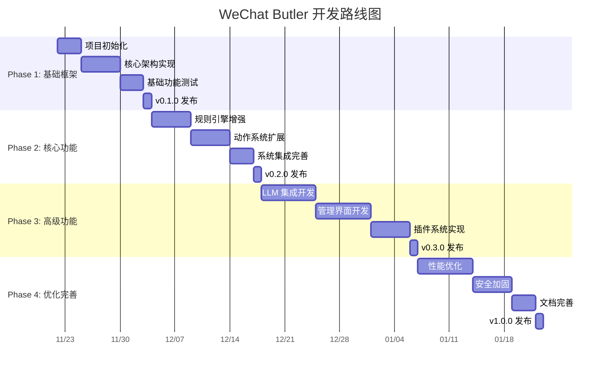

# WeChat Butler 开发路线图

## 文档信息

- **版本**: v1.0.0
- **创建日期**: 2025-11-22
- **最后更新**: 2025-11-22
- **维护者**: 项目管理团队

---

## 📋 目录

- [版本规划概述](#版本规划概述)
- [Phase 1: 基础框架 (v0.1.0)](#phase-1-基础框架-v010)
- [Phase 2: 核心功能 (v0.2.0)](#phase-2-核心功能-v020)
- [Phase 3: 高级功能 (v0.3.0)](#phase-3-高级功能-v030)
- [Phase 4: 优化完善 (v1.0.0)](#phase-4-优化完善-v100)
- [里程碑时间表](#里程碑时间表)
- [风险评估](#风险评估)
- [资源需求](#资源需求)

---

## 版本规划概述

WeChat Butler 采用渐进式开发策略，从最小可行产品开始，逐步增加功能和优化体验。整个开发计划分为四个主要阶段：

---

## Phase 1: 基础框架 (v0.1.0)

### 🎯 目标
建立项目基础框架，实现最核心的消息处理功能。

### 📋 功能清单

#### 核心功能
- ✅ **Webhook 接收服务**
  - 接收 chatshell-api 的 webhook 请求
  - HMAC-SHA256 签名验证
  - 请求限流和防抖处理
  - 基础错误处理和日志

- ✅ **消息处理管道**
  - 消息解析和标准化
  - 基础消息验证
  - 简单的消息路由

- ✅ **基础规则引擎**
  - 关键词匹配条件
  - 简单的规则优先级
  - YAML 规则文件解析

- ✅ **基础动作执行**
  - 微信消息回复动作
  - 集成 wechat-sendmsg
  - 基础错误重试机制

- ✅ **HTTP API 服务**
  - 健康检查接口
  - 规则查询接口
  - 系统状态接口

#### 技术实现
- ✅ **项目骨架**
  - Python 3.11+ 环境配置
  - FastAPI Web 框架集成
  - 基础依赖管理 (requirements.txt)
  - 项目目录结构规范

- ✅ **配置系统**
  - YAML 配置文件解析
  - 配置验证和默认值
  - 环境变量支持

- ✅ **日志系统**
  - 结构化日志输出
  - 日志级别控制
  - 日志文件轮转

#### 质量保证
- ✅ **单元测试**
  - 核心组件单元测试
  - 测试覆盖率 > 70%
  - 持续集成配置

- ✅ **集成测试**
  - 与 chatshell-api 集成测试
  - 与 wechat-sendmsg 集成测试
  - 端到端功能测试

#### 文档
- ✅ **开发文档**
  - 项目 README
  - 架构设计文档
  - API 接口文档
  - 部署指南

- ✅ **用户文档**
  - 快速开始指南
  - 配置说明文档
  - 基础规则编写指南

### 🚀 交付物
1. 可运行的 WeChat Butler v0.1.0
2. 完整的开发文档
3. 基础测试套件
4. 示例配置和规则

---

## Phase 2: 核心功能 (v0.2.0)

### 🎯 目标
完善核心功能，提供更强大的规则和动作支持。

### 📋 功能清单

#### 规则引擎增强
- 🔄 **条件类型扩展**
  - 正则表达式匹配
  - 发送者/对话者过滤
  - 消息类型过滤
  - 时间范围条件
  - 组合条件 (AND/OR/NOT)

- 🔄 **规则管理**
  - 规则导入/导出
  - 规则测试工具
  - 规则优先级管理
  - 规则分组和标签

- 🔄 **上下文支持**
  - 会话上下文管理
  - 变量和模板支持
  - 状态持久化
  - 条件缓存优化

#### 动作系统扩展
- 🔄 **动作类型增加**
  - 消息转发动作
  - 系统命令执行
  - HTTP API 调用
  - 文件操作动作
  - 通知发送动作

- 🔄 **动作控制**
  - 动作执行超时控制
  - 动作重试策略
  - 动作执行结果处理
  - 动作链式执行

#### 系统集成完善
- 🔄 **chatshell-api 深度集成**
  - 支持更多消息类型
  - 消息状态同步
  - 批量消息处理
  - 连接健康检查

- 🔄 **wechat-sendmsg 优化**
  - 发送状态跟踪
  - 发送失败处理
  - 发送速率控制
  - 媒体文件支持

#### 监控和管理
- 🔄 **系统监控**
  - 性能指标收集
  - 处理统计信息
  - 错误率监控
  - 资源使用监控

- 🔄 **管理接口**
  - 规则管理 API
  - 系统控制 API
  - 状态查询 API
  - 日志查询 API

#### 质量提升
- 🔄 **性能优化**
  - 消息处理性能优化
  - 内存使用优化
  - 启动时间优化
  - 规则匹配优化

- 🔄 **稳定性增强**
  - 异常恢复机制
  - 进程健康检查
  - 配置热重载
  - 数据持久化

### 🚀 交付物
1. WeChat Butler v0.2.0 版本
2. 完整的规则系统
3. 丰富的动作支持
4. 系统监控和管理功能

---

## Phase 3: 高级功能 (v0.3.0)

### 🎯 目标
引入 AI 能力和现代化管理界面，提升用户体验。

### 📋 功能清单

#### LLM 智能集成
- 🤖 **LLM 服务支持**
  - OpenAI GPT 系列集成
  - Claude API 集成
  - DeepSeek API 集成
  - 本地模型支持 (可选)

- 🤖 **智能规则**
  - LLM 条件判断
  - 智能回复生成
  - 意图识别和分析
  - 上下文理解增强

- 🤖 **提示词管理**
  - 提示词模板系统
  - 上下文管理优化
  - 响应格式控制
  - 成本控制和限流

#### Web 管理界面
- 🖥️ **仪表盘**
  - 系统状态概览
  - 实时消息监控
  - 处理统计图表
  - 性能指标展示

- 🖥️ **规则管理界面**
  - 可视化规则编辑
  - 规则测试工具
  - 规则导入/导出
  - 规则版本管理

- 🖥️ **日志查看器**
  - 实时日志查看
  - 日志搜索和过滤
  - 错误日志分析
  - 审计日志管理

- 🖥️ **系统配置**
  - 可视化配置编辑
  - 配置验证和测试
  - 配置备份恢复
  - 用户权限管理

#### 插件系统
- 🔌 **插件架构**
  - 插件接口定义
  - 插件加载机制
  - 插件热部署
  - 插件依赖管理

- 🔌 **官方插件**
  - 数据库存储插件
  - 消息队列插件
  - 通知服务插件
  - 第三方服务插件

- 🔌 **插件市场**
  - 插件发布机制
  - 插件版本管理
  - 插件安全验证
  - 社区插件支持

#### 开发者体验
- 🔧 **开发工具**
  - 本地开发环境
  - 调试工具支持
  - 测试框架完善
  - 代码生成工具

- 🔧 **API 增强**
  - OpenAPI 文档完善
  - API 客户端生成
  - WebSocket 支持
  - 事件订阅系统

### 🚀 交付物
1. WeChat Butler v0.3.0 版本
2. LLM 智能集成功能
3. 完整的 Web 管理界面
4. 插件系统框架

---

## Phase 4: 优化完善 (v1.0.0)

### 🎯 目标
系统优化、安全加固和稳定性提升，达到生产就绪状态。

### 📋 功能清单

#### 性能优化
- ⚡ **系统性能**
  - 消息处理延迟优化
  - 内存使用优化
  - 启动时间优化
  - 并发处理能力提升

- ⚡ **规则引擎优化**
  - 规则编译优化
  - 匹配算法优化
  - 缓存策略优化
  - 并行处理支持

- ⚡ **资源管理**
  - 连接池优化
  - 文件句柄管理
  - 内存泄漏检测
  - 垃圾回收优化

#### 安全加固
- 🔒 **认证授权**
  - JWT 令牌支持
  - OAuth 2.0 集成
  - 角色权限管理
  - 审计日志完善

- 🔒 **数据安全**
  - 配置加密存储
  - 敏感数据脱敏
  - 安全通信协议
  - 数据备份恢复

- 🔒 **运行时安全**
  - 沙箱执行环境
  - 资源限制控制
  - 安全漏洞扫描
  - 依赖安全更新

#### 稳定性提升
- 🛡️ **高可用性**
  - 进程监控和重启
  - 健康检查完善
  - 故障转移支持
  - 数据持久化保障

- 🛡️ **容错处理**
  - 优雅降级机制
  - 错误隔离处理
  - 自动恢复策略
  - 灾难恢复计划

- 🛡️ **监控告警**
  - 监控指标完善
  - 告警规则配置
  - 通知渠道扩展
  - 性能基线建立

#### 文档完善
- 📚 **技术文档**
  - 架构设计文档
  - API 参考文档
  - 部署运维文档
  - 故障排查手册

- 📚 **用户文档**
  - 完整用户手册
  - 最佳实践指南
  - 视频教程制作
  - 常见问题解答

- 📚 **开发者文档**
  - 插件开发指南
  - 贡献指南完善
  - 代码规范文档
  - 测试指南文档

#### 生态建设
- 🌐 **社区支持**
  - 社区论坛建设
  - 问题反馈系统
  - 贡献者指南
  - 版本发布管理

- 🌐 **集成生态**
  - 第三方服务集成
  - 开源项目协作
  - 标准化接口定义
  - 兼容性测试套件

### 🚀 交付物
1. WeChat Butler v1.0.0 正式版
2. 生产就绪的稳定系统
3. 完整的技术文档体系
4. 活跃的开发者社区

---

## 里程碑时间表

### 短期目标 (1个月内)
- [ ] v0.1.0 基础框架发布
- [ ] 核心消息处理功能
- [ ] 基础规则引擎
- [ ] 与现有系统集成

### 中期目标 (3个月内)
- [ ] v0.2.0 核心功能发布
- [ ] 完整规则系统
- [ ] 多种动作支持
- [ ] 系统监控管理

### 长期目标 (6个月内)
- [ ] v0.3.0 高级功能发布
- [ ] LLM 智能集成
- [ ] Web 管理界面
- [ ] 插件系统框架

### 最终目标 (1年内)
- [ ] v1.0.0 正式版发布
- [ ] 生产环境就绪
- [ ] 完整文档体系
- [ ] 活跃社区生态

---

## 风险评估

### 技术风险
1. **微信接口稳定性**
   - **风险**: wechat-sendmsg 依赖微信 GUI 自动化，可能因微信更新而失效
   - **缓解**: 定期测试和更新适配，提供降级方案

2. **LLM 服务可用性**
   - **风险**: 第三方 LLM 服务不稳定或 API 变更
   - **缓解**: 多服务商支持，本地模型备选，API 抽象层

3. **性能瓶颈**
   - **风险**: 消息处理延迟随规则数量增加而上升
   - **缓解**: 规则引擎优化，缓存策略，异步处理

### 项目风险
1. **开发资源不足**
   - **风险**: 个人项目，开发时间有限
   - **缓解**: 聚焦核心功能，采用渐进式开发

2. **需求变更**
   - **风险**: 使用过程中发现新需求
   - **缓解**: 灵活的架构设计，插件化扩展

3. **兼容性问题**
   - **风险**: 不同环境下的兼容性问题
   - **缓解**: 容器化部署，环境检测，兼容性测试

### 运营风险
1. **用户数据安全**
   - **风险**: 处理敏感微信消息数据
   - **缓解**: 本地化处理，数据加密，权限控制

2. **系统稳定性**
   - **风险**: 长时间运行可能出现内存泄漏等问题
   - **缓解**: 完善的监控告警，自动重启机制

3. **维护成本**
   - **风险**: 随着功能增加，维护成本上升
   - **缓解**: 代码质量保证，自动化测试，文档完善

---

## 资源需求

### 开发资源
- **开发人员**: 1-2 名全栈开发者
- **开发时间**: 6-12 个月（兼职开发）
- **开发环境**: Python 3.11+, Node.js 18+, Docker
- **测试设备**: 多平台测试环境（Windows/macOS/Linux）

### 技术资源
- **基础设施**: GitHub 代码托管，CI/CD 流水线
- **文档工具**: Markdown 文档，Swagger API 文档
- **测试工具**: pytest, Postman, 自动化测试框架
- **监控工具**: 日志系统，性能监控，错误追踪

### 运营资源
- **部署环境**: 个人电脑，树莓派，云服务器
- **备份方案**: 配置备份，规则备份，日志归档
- **支持渠道**: GitHub Issues，文档，社区论坛
- **更新机制**: 版本发布，更新通知，迁移工具

---

## 成功标准

### 技术标准
- ✅ 消息处理延迟 < 100ms
- ✅ 系统可用性 > 99.9%
- ✅ 内存占用 < 100MB
- ✅ 测试覆盖率 > 80%

### 功能标准
- ✅ 支持 10+ 种规则条件
- ✅ 支持 5+ 种动作类型
- ✅ 集成 3+ 种 LLM 服务
- ✅ 提供完整的 API 接口

### 用户体验
- ✅ 5分钟内完成安装配置
- ✅ 直观的规则配置界面
- ✅ 完善的错误提示和日志
- ✅ 响应式的用户支持

### 社区标准
- ✅ 活跃的 GitHub 仓库
- ✅ 完整的文档体系
- ✅ 积极的社区互动
- ✅ 定期的版本发布

---

## 总结

WeChat Butler 的开发路线图采用渐进式、迭代式的开发策略，从最小可行产品开始，逐步完善功能和优化体验。每个阶段都有明确的目标和交付物，确保项目稳步推进。

通过合理的风险评估和资源规划，我们能够在保证项目质量的同时，控制开发成本和风险。最终目标是打造一个稳定、易用、功能丰富的微信消息自动化工具，为用户提供真正的价值。

让我们开始这段精彩的开发旅程吧！🚀