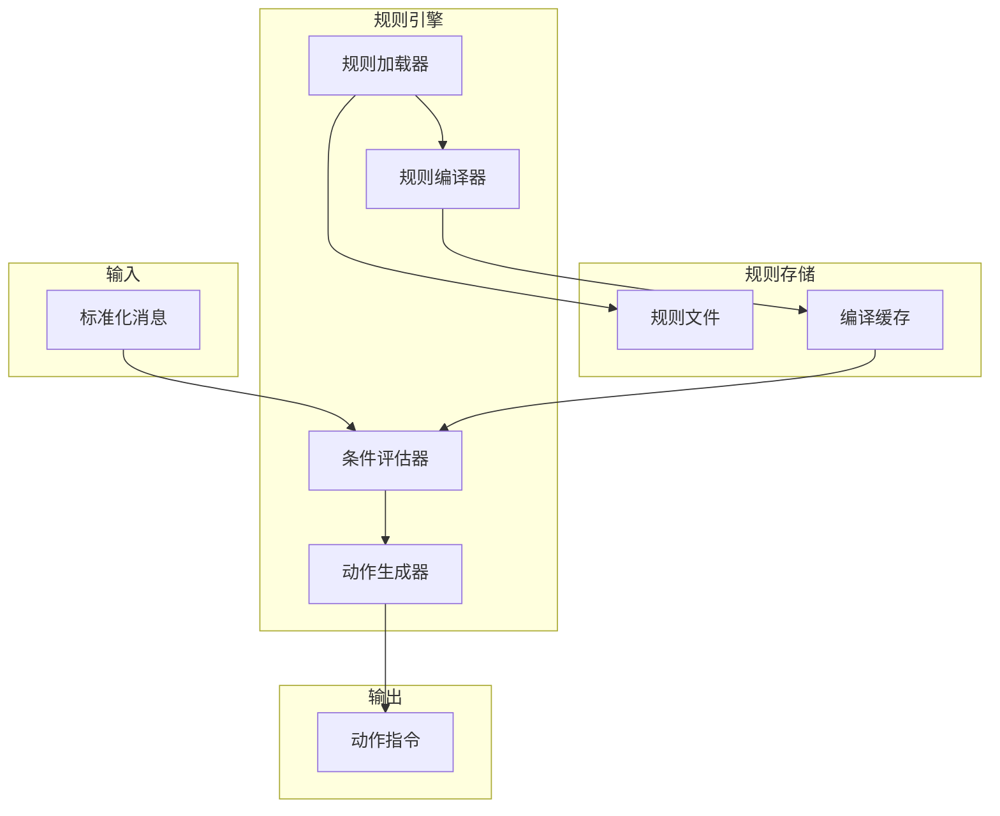
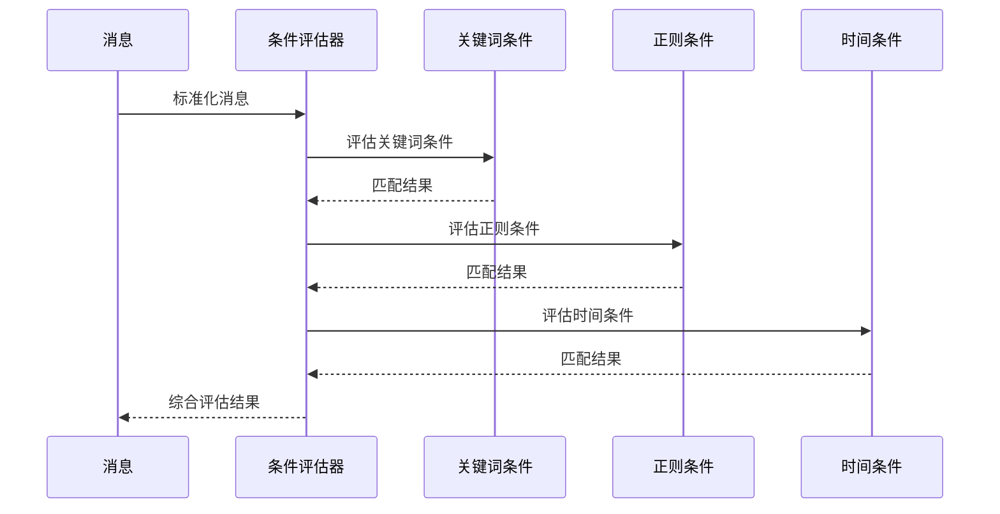
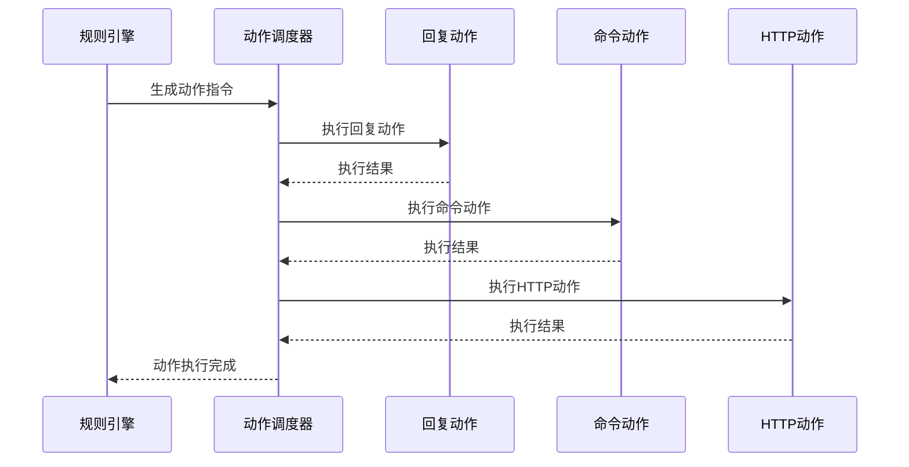
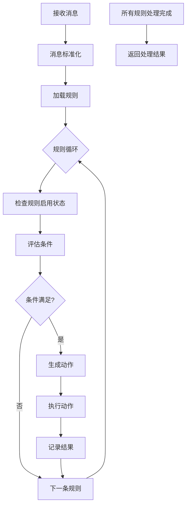

# WeChat Butler 规则引擎详解

## 文档信息

- **版本**: v1.0.0
- **创建日期**: 2025-11-22
- **最后更新**: 2025-11-22
- **适用版本**: v0.1.0+

---

## 📋 目录

- [概述](#概述)
- [规则定义格式](#规则定义格式)
- [条件系统](#条件系统)
- [动作系统](#动作系统)
- [规则匹配流程](#规则匹配流程)
- [性能优化](#性能优化)
- [扩展开发](#扩展开发)
- [最佳实践](#最佳实践)

---

## 概述

WeChat Butler 规则引擎是一个轻量级、高性能的消息处理引擎，负责根据预定义的规则匹配微信消息并触发相应的动作。引擎采用声明式配置，支持多种条件类型和动作类型，具有高度的灵活性和可扩展性。

### 核心特性

- **声明式配置**: 使用 YAML 格式定义规则，易于理解和维护
- **多条件支持**: 支持关键词、正则表达式、发送者、时间等多种条件
- **组合条件**: 支持 AND/OR/NOT 逻辑组合
- **优先级控制**: 规则按优先级顺序执行
- **上下文感知**: 支持会话上下文和变量替换
- **高性能**: 采用编译缓存和优化算法，毫秒级匹配

### 架构设计



---

## 规则定义格式

### 基本结构

```yaml
rules:
  - name: "规则名称"
    description: "规则描述"
    enabled: true
    priority: 100
    conditions:
      # 条件列表
    actions:
      # 动作列表
```

### 字段说明

| 字段 | 类型 | 必填 | 默认值 | 说明 |
|------|------|------|--------|------|
| `name` | string | 是 | - | 规则名称，用于标识规则 |
| `description` | string | 否 | "" | 规则描述，便于理解规则用途 |
| `enabled` | boolean | 否 | true | 是否启用规则 |
| `priority` | integer | 否 | 100 | 规则优先级，数值越大优先级越高 |
| `conditions` | array | 是 | - | 条件列表，所有条件必须同时满足 |
| `actions` | array | 是 | - | 动作列表，按顺序执行 |

### 完整示例

```yaml
rules:
  - name: "智能客服自动回复"
    description: "工作时间自动回复客户咨询"
    enabled: true
    priority: 200
    conditions:
      - type: "keyword"
        field: "content"
        value: ["咨询", "问题", "help", "?"]
        case_sensitive: false
      - type: "time"
        start: "09:00"
        end: "18:00"
        weekdays: [1, 2, 3, 4, 5]
      - type: "talker"
        value: ["客户群", "客服"]
    actions:
      - type: "reply"
        content: "您好，客服将在1小时内回复您的问题。"
        delay: 2
      - type: "notification"
        title: "新客户咨询"
        message: "来自 {{talker}} 的咨询：{{content}}"
```

---

## 条件系统

### 条件类型

#### 1. 关键词条件 (keyword)
匹配消息内容中的关键词。

```yaml
- type: "keyword"
  field: "content"        # 要匹配的字段，通常为 content
  value: ["你好", "hello"] # 关键词列表
  case_sensitive: false   # 是否区分大小写，默认 false
  mode: "any"            # 匹配模式：any（任意一个）或 all（全部）
```

**实现原理**:
- 将关键词预处理为小写（如果不区分大小写）
- 使用字符串查找算法快速匹配
- 支持中文分词优化（可选）

#### 2. 正则表达式条件 (regex)
使用正则表达式匹配消息内容。

```yaml
- type: "regex"
  field: "content"
  value: "https?://\\S+"  # 正则表达式
  flags: "i"              # 正则标志：i（忽略大小写），m（多行）
```

**实现原理**:
- 编译正则表达式并缓存
- 支持常见的正则表达式语法
- 提供超时保护，防止复杂正则导致性能问题

#### 3. 发送者条件 (sender)
匹配消息发送者。

```yaml
- type: "sender"
  value: ["张三", "李四"]  # 发送者列表
  mode: "exact"           # 匹配模式：exact（精确）或 prefix（前缀）
```

#### 4. 对话者条件 (talker)
匹配消息对话者（群聊或联系人）。

```yaml
- type: "talker"
  value: ["工作群", "家庭群"]
  mode: "exact"
```

#### 5. 消息类型条件 (type)
匹配消息类型。

```yaml
- type: "type"
  value: [1, 3, 47]  # 1=文本，3=图片，47=表情
```

#### 6. 时间条件 (time)
基于时间的条件匹配。

```yaml
- type: "time"
  start: "09:00"          # 开始时间
  end: "18:00"            # 结束时间
  weekdays: [1, 2, 3, 4, 5]  # 星期几：1=周一，7=周日
  dates: ["2025-01-01"]   # 特定日期
  exclude: false          # 是否排除这个时间段
```

#### 7. 组合条件 (group)
组合多个条件，支持逻辑运算。

```yaml
- type: "group"
  operator: "AND"         # 逻辑运算符：AND, OR, NOT
  conditions:
    - type: "keyword"
      value: ["重要"]
    - type: "sender"
      value: ["领导"]
```

### 条件评估流程



### 自定义条件开发

```python
from typing import Dict, Any
from wechat_butler.conditions import BaseCondition

class CustomCondition(BaseCondition):
    """自定义条件示例"""
    
    def __init__(self, config: Dict[str, Any]):
        super().__init__(config)
        self.threshold = config.get("threshold", 0.5)
    
    def evaluate(self, message: Dict[str, Any]) -> bool:
        """评估条件"""
        content = message.get("content", "")
        # 自定义评估逻辑
        score = self.calculate_score(content)
        return score >= self.threshold
    
    def calculate_score(self, content: str) -> float:
        """计算分数"""
        # 自定义评分逻辑
        return len(content) / 100.0
```

---

## 动作系统

### 动作类型

#### 1. 回复动作 (reply)
回复微信消息。

```yaml
- type: "reply"
  content: "回复内容"      # 回复内容，支持模板变量
  delay: 1                # 延迟秒数
  to: "{{sender}}"        # 回复对象，默认使用原发送者
```

**模板变量**:
- `{{talker}}`: 对话者
- `{{sender}}`: 发送者
- `{{content}}`: 消息内容
- `{{timestamp}}`: 时间戳
- `{{now}}`: 当前时间

#### 2. 转发动作 (forward)
转发消息到其他对话。

```yaml
- type: "forward"
  to: "目标群聊"           # 目标对话
  prefix: "[转发] "        # 转发前缀
  include_sender: true    # 是否包含发送者信息
```

#### 3. 命令动作 (command)
执行系统命令。

```yaml
- type: "command"
  command: "python"       # 命令
  args: ["script.py"]     # 参数列表
  timeout: 30             # 超时时间（秒）
  cwd: "/tmp"             # 工作目录
  env:                    # 环境变量
    KEY: "value"
```

#### 4. HTTP 动作 (http)
调用 HTTP API。

```yaml
- type: "http"
  url: "https://api.example.com/webhook"
  method: "POST"          # HTTP 方法
  headers:                # 请求头
    Content-Type: "application/json"
  body:                   # 请求体，支持模板
    message: "{{content}}"
    sender: "{{sender}}"
  timeout: 10             # 超时时间（秒）
```

#### 5. 通知动作 (notification)
发送系统通知。

```yaml
- type: "notification"
  title: "新消息提醒"
  message: "来自 {{sender}} 的消息"
  level: "info"          # 级别：info, warning, error
```

#### 6. LLM 动作 (llm)
调用 LLM 生成回复。

```yaml
- type: "llm"
  provider: "openai"     # 服务商：openai, claude, deepseek
  model: "gpt-3.5-turbo" # 模型名称
  prompt: "请回复以下消息：{{content}}"
  max_tokens: 100        # 最大 token 数
  temperature: 0.7       # 温度参数
```

### 动作执行流程



### 自定义动作开发

```python
from typing import Dict, Any
from wechat_butler.actions import BaseAction

class CustomAction(BaseAction):
    """自定义动作示例"""
    
    def __init__(self, config: Dict[str, Any]):
        super().__init__(config)
        self.api_url = config.get("api_url")
    
    async def execute(self, context: Dict[str, Any]) -> Dict[str, Any]:
        """执行动作"""
        message = context["message"]
        
        # 构建请求
        payload = {
            "content": message["content"],
            "sender": message["sender"]
        }
        
        # 发送请求
        response = await self.http_client.post(
            self.api_url,
            json=payload
        )
        
        return {
            "success": response.status_code == 200,
            "data": response.json()
        }
```

---

## 规则匹配流程

### 完整处理流程



### 详细步骤

1. **消息预处理**
   ```python
   def preprocess_message(message):
       # 标准化消息格式
       standardized = {
           "id": message.get("msgId"),
           "timestamp": message.get("createTime"),
           "talker": message.get("talker"),
           "sender": message.get("sender"),
           "content": message.get("content", ""),
           "type": message.get("type", 1),
           "raw": message
       }
       
       # 内容预处理
       standardized["content_lower"] = standardized["content"].lower()
       standardized["words"] = segment_content(standardized["content"])
       
       return standardized
   ```

2. **规则加载和编译**
   ```python
   class RuleEngine:
       def load_rules(self):
           # 加载所有规则文件
           for rule_file in self.rules_dir.glob("*.yaml"):
               rules = yaml.safe_load(rule_file.read_text())
               for rule in rules.get("rules", []):
                   compiled = self.compile_rule(rule)
                   self.rules.append(compiled)
       
       def compile_rule(self, rule):
           # 编译规则，优化性能
           compiled = {
               "name": rule["name"],
               "enabled": rule.get("enabled", True),
               "priority": rule.get("priority", 100),
               "conditions": self.compile_conditions(rule["conditions"]),
               "actions": rule["actions"]
           }
           return compiled
   ```

3. **条件评估优化**
   ```python
   def evaluate_conditions(compiled_conditions, message):
       # 快速失败优化
       for condition in compiled_conditions:
           if not condition["evaluator"](message):
               return False
       return True
   ```

4. **动作执行管理**
   ```python
   async def execute_actions(actions, context):
       results = []
       for action in actions:
           try:
               result = await self.execute_single_action(action, context)
               results.append(result)
               
               # 如果动作失败且配置了停止，则中断执行
               if not result["success"] and action.get("stop_on_failure"):
                   break
                   
           except Exception as e:
               results.append({
                   "success": False,
                   "error": str(e)
               })
       return results
   ```

---

## 性能优化

### 1. 规则编译缓存

```python
class RuleCompiler:
    def __init__(self):
        self.cache = {}  # 规则编译缓存
        self.condition_cache = {}  # 条件编译缓存
    
    def compile_rule(self, rule_config):
        # 生成缓存键
        cache_key = hashlib.md5(
            json.dumps(rule_config, sort_keys=True).encode()
        ).hexdigest()
        
        # 检查缓存
        if cache_key in self.cache:
            return self.cache[cache_key]
        
        # 编译规则
        compiled = self._compile_rule_internal(rule_config)
        
        # 更新缓存
        self.cache[cache_key] = compiled
        return compiled
```

### 2. 条件评估优化

```python
class ConditionOptimizer:
    @staticmethod
    def optimize_conditions(conditions):
        """优化条件评估顺序"""
        # 按评估成本排序：低成本条件先评估
        return sorted(
            conditions,
            key=lambda c: c.get("cost", 1)
        )
    
    @staticmethod
    def estimate_cost(condition):
        """估算条件评估成本"""
        cost_map = {
            "sender": 1,      # 哈希查找，成本低
            "talker": 1,
            "type": 1,
            "keyword": 2,     # 字符串搜索，成本中等
            "regex": 5,       # 正则匹配，成本较高
            "time": 3,        # 时间计算，成本中等
            "llm": 100        # LLM调用，成本很高
        }
        return cost_map.get(condition["type"], 10)
```

### 3. 批量消息处理

```python
async def process_batch(messages, batch_size=10):
    """批量处理消息"""
    results = []
    
    for i in range(0, len(messages), batch_size):
        batch = messages[i:i+batch_size]
        
        # 并行处理批次
        batch_results = await asyncio.gather(*[
            process_single_message(msg)
            for msg in batch
        ])
        
        results.extend(batch_results)
    
    return results
```

### 4. 内存使用优化

```python
class MemoryOptimizedRuleEngine:
    def __init__(self):
        self.rules = []
        self.rule_index = {}  # 规则索引，加速查找
    
    def build_index(self):
        """构建规则索引"""
        self.rule_index = {
            "by_talker": defaultdict(list),
            "by_sender": defaultdict(list),
            "by_keyword": defaultdict(list)
        }
        
        for rule in self.rules:
            # 提取规则特征，构建索引
            self._index_rule(rule)
    
    def find_candidate_rules(self, message):
        """使用索引快速查找候选规则"""
        candidates = set()
        
        # 按对话者查找
        talker_rules = self.rule_index["by_talker"].get(message["talker"], [])
        candidates.update(talker_rules)
        
        # 按发送者查找
        sender_rules = self.rule_index["by_sender"].get(message["sender"], [])
        candidates.update(sender_rules)
        
        # 按关键词查找（如果有）
        for word in message.get("words", []):
            keyword_rules = self.rule_index["by_keyword"].get(word, [])
