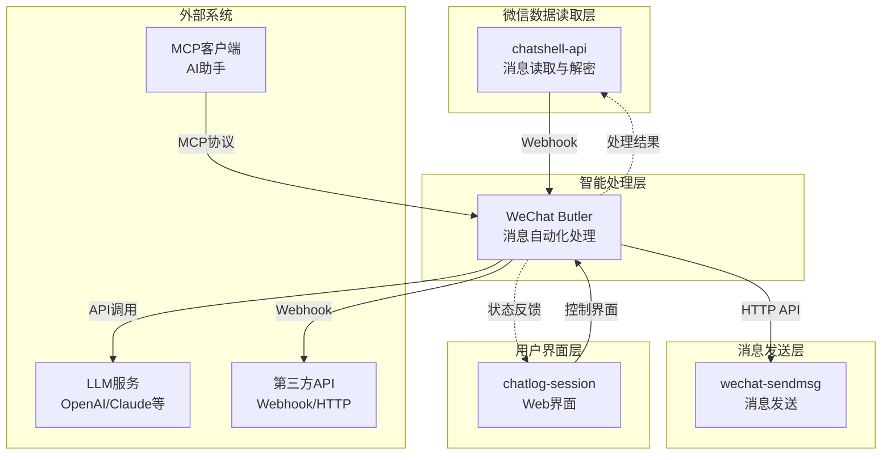
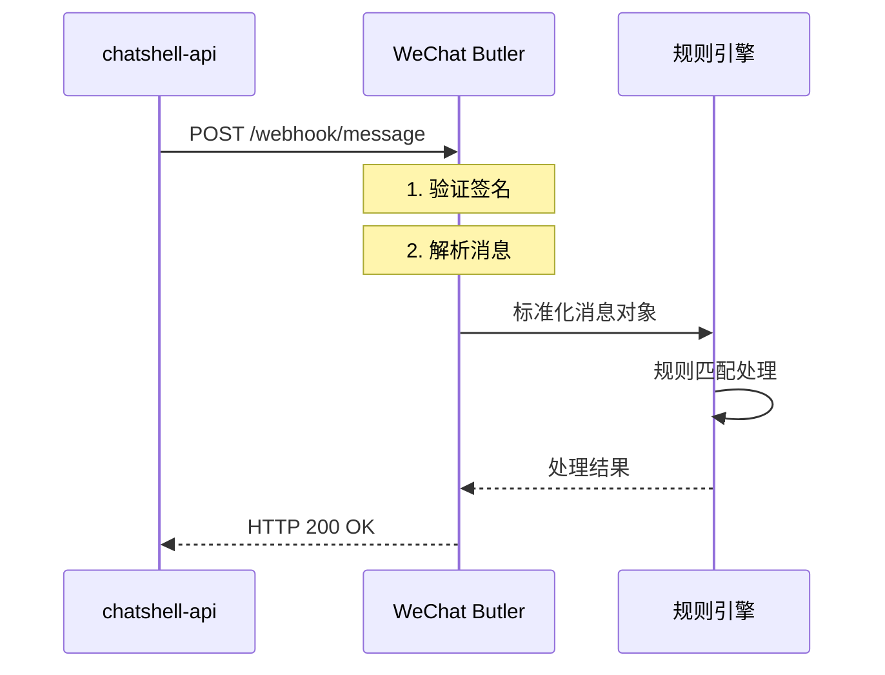

# WeChat Butler 系统集成方案

## 文档信息

- **版本**: v1.0.0
- **创建日期**: 2025-11-22
- **最后更新**: 2025-11-22
- **适用版本**: v0.1.0+

---

## 📋 目录

- [概述](#概述)
- [与 chatshell-api 集成](#与-chatshell-api-集成)
- [与 wechat-sendmsg 集成](#与-wechat-sendmsg-集成)
- [与 chatlog-session 集成](#与-chatlog-session-集成)
- [HTTP API 集成](#http-api-集成)
- [MCP 协议集成](#mcp-协议集成)
- [第三方服务集成](#第三方服务集成)
- [集成测试方案](#集成测试方案)

---

## 概述

WeChat Butler 设计为微信生态系统的"智能中枢"，与现有工具链无缝集成，形成一个完整的微信消息自动化解决方案。

### 集成架构图



### 集成特点

1. **松耦合设计**: 各组件通过标准接口通信，独立部署和升级
2. **协议标准化**: 使用 HTTP/RESTful API、Webhook、MCP 等标准协议
3. **配置驱动**: 通过配置文件定义集成参数，无需修改代码
4. **容错处理**: 集成失败时优雅降级，不影响核心功能
5. **监控可观测**: 提供完整的集成状态监控和日志

---

## 与 chatshell-api 集成

### 集成方式

WeChat Butler 通过 Webhook 接收 chatshell-api 的新消息通知。

### 配置示例

```yaml
# config.yaml
webhook:
  enabled: true
  secret: "your-secret-key-here"
  path: "/webhook/message"
  
chatshell_api:
  url: "http://localhost:5030"
  version: "v1"
```

### chatshell-api 配置

启动 chatshell-api 时启用 Webhook：

```bash
./bin/chatlog server \
  --webhook-host http://localhost:8080 \
  --webhook-path /webhook/message \
  --webhook-secret your-secret-key-here \
  --webhook-events message.new
```

### 消息格式

chatshell-api 发送的 Webhook 消息格式：

```json
{
  "event": "message.new",
  "timestamp": 1732252800,
  "data": {
    "msgId": "123456789",
    "talker": "filehelper",
    "sender": "user123",
    "content": "Hello World",
    "type": 1,
    "createTime": 1732252800,
    "isSend": 0
  }
}
```

### 消息处理流程



### 高级集成功能

#### 1. 消息状态同步
```yaml
chatshell_api:
  sync_message_status: true
  status_callback: "/api/v1/message/status"
```

#### 2. 批量消息处理
```yaml
webhook:
  batch_size: 10
  batch_timeout: 5000  # 毫秒
```

#### 3. 消息去重
```yaml
webhook:
  deduplication:
    enabled: true
    ttl: 3600  # 去重时间窗口（秒）
```

### 错误处理

1. **Webhook 失败重试**: chatshell-api 内置重试机制
2. **消息验证失败**: 返回 400 错误，包含详细错误信息
3. **处理超时**: 设置合理的超时时间，避免阻塞
4. **服务不可用**: 健康检查接口监控服务状态

---

## 与 wechat-sendmsg 集成

### 集成方式

WeChat Butler 通过 HTTP API 调用 wechat-sendmsg 发送微信消息。

### 配置示例

```yaml
# config.yaml
wechat:
  sendmsg:
    enabled: true
    url: "http://localhost:8000"
    api_key: "your-api-key"
    timeout: 30
    retry:
      max_attempts: 3
      delay: 1000
```

### 消息发送接口

#### 1. 发送文本消息
```python
# WeChat Butler 内部实现
async def send_text_message(to, content, options=None):
    payload = {
        "action": "send_message",
        "params": {
            "to": to,
            "content": content,
            **options
        }
    }
    
    response = await http_client.post(
        f"{config.wechat.sendmsg.url}/api/execute",
        json=payload,
        headers={"X-API-Key": config.wechat.sendmsg.api_key}
    )
    
    return response.json()
```

#### 2. 发送图片消息
```python
async def send_image_message(to, image_path, options=None):
    # 读取图片文件
    with open(image_path, 'rb') as f:
        image_data = f.read()
    
    # 发送到 wechat-sendmsg
    files = {'image': ('image.jpg', image_data, 'image/jpeg')}
    data = {'to': to, **options}
    
    response = await http_client.post(
        f"{config.wechat.sendmsg.url}/api/send_image",
        files=files,
        data=data,
        headers={"X-API-Key": config.wechat.sendmsg.api_key}
    )
    
    return response.json()
```

### 发送状态跟踪

```yaml
wechat:
  sendmsg:
    track_status: true
    status_poll_interval: 1000  # 状态轮询间隔（毫秒）
    status_timeout: 30000       # 状态跟踪超时（毫秒）
```

### 错误处理策略

1. **发送失败重试**: 配置重试次数和延迟
2. **速率限制**: 控制消息发送频率
3. **队列管理**: 消息排队发送，避免拥堵
4. **降级方案**: 发送失败时记录日志并通知用户

### 性能优化

1. **连接池**: 复用 HTTP 连接，减少连接开销
2. **批量发送**: 支持批量消息发送
3. **异步发送**: 非阻塞消息发送，提高吞吐量
4. **缓存优化**: 缓存联系人信息，减少查询

---

## 与 chatlog-session 集成

### 集成方式

chatlog-session 可以通过 WeChat Butler 的 HTTP API 进行控制和状态查询。

### 配置示例

```yaml
# config.yaml
chatlog_session:
  enabled: true
  url: "http://localhost:5173"
  api_path: "/api/wechat-butler"
```

### 前端集成代码

```typescript
// chatlog-session 前端集成
import { WeChatButlerClient } from '@wechat-butler/client'

class WeChatButlerIntegration {
  private client: WeChatButlerClient
  
  constructor(baseURL: string) {
    this.client = new WeChatButlerClient({
      baseURL,
      timeout: 10000
    })
  }
  
  // 获取规则列表
  async getRules() {
    return this.client.get('/api/v1/rules')
  }
  
  // 执行命令
  async executeCommand(command: string, params: any) {
    return this.client.post('/api/v1/commands/execute', {
      command,
      params
    })
  }
  
  // 订阅实时状态
  subscribeToStatus(callback: (status: any) => void) {
    const eventSource = new EventSource(`${this.client.baseURL}/api/v1/events`)
    
    eventSource.onmessage = (event) => {
      const data = JSON.parse(event.data)
      callback(data)
    }
    
    return () => eventSource.close()
  }
}
```

### 界面集成方案

#### 1. 侧边栏集成
在 chatlog-session 侧边栏添加 WeChat Butler 控制面板：

```vue
<!-- WeChatButlerPanel.vue -->
<template>
  <div class="wechat-butler-panel">
    <h3>微信管家</h3>
    
    <div class="status">
      <span :class="['status-indicator', status]"></span>
      <span>{{ statusText }}</span>
    </div>
    
    <div class="controls">
      <button @click="toggleService">
        {{ isRunning ? '停止' : '启动' }}服务
      </button>
      <button @click="reloadRules">重载规则</button>
    </div>
    
    <div class="stats">
      <div>处理消息: {{ stats.processed }}</div>
      <div>成功: {{ stats.success }}</div>
      <div>失败: {{ stats.failed }}</div>
    </div>
  </div>
</template>
```

#### 2. 消息上下文菜单
在消息气泡上添加 WeChat Butler 操作菜单：

```vue
<!-- MessageContextMenu.vue -->
<template>
  <div class="context-menu">
    <!-- 原有菜单项 -->
    
    <div class="divider"></div>
    
    <!-- WeChat Butler 菜单项 -->
    <div class="menu-item" @click="createRuleFromMessage">
      创建自动回复规则
    </div>
    <div class="menu-item" @click="forwardToButler">
      转发到微信管家
    </div>
    <div class="menu-item" @click="analyzeWithAI">
      AI分析消息
    </div>
  </div>
</template>
```

#### 3. 规则管理界面
集成完整的规则管理界面：

```vue
<!-- RuleManager.vue -->
<template>
  <div class="rule-manager">
    <div class="header">
      <h2>自动回复规则</h2>
      <button @click="createNewRule">新建规则</button>
    </div>
    
    <div class="rule-list">
      <RuleItem
        v-for="rule in rules"
        :key="rule.id"
        :rule="rule"
        @toggle="toggleRule"
        @edit="editRule"
        @delete="deleteRule"
      />
    </div>
    
    <RuleEditor
      v-if="editingRule"
      :rule="editingRule"
      @save="saveRule"
      @cancel="cancelEdit"
    />
  </div>
</template>
```

### 数据同步

#### 1. 实时状态同步
```typescript
// WebSocket 实时状态同步
const setupRealtimeSync = () => {
  const ws = new WebSocket('ws://localhost:8080/ws/status')
  
  ws.onmessage = (event) => {
    const data = JSON.parse(event.data)
    
    switch (data.type) {
      case 'message_processed':
        updateMessageStatus(data.messageId, data.result)
        break
      case 'rule_matched':
        showRuleMatchNotification(data.rule, data.message)
        break
      case 'service_status':
        updateServiceStatus(data.status)
        break
    }
  }
}
```

#### 2. 配置同步
```typescript
// 配置同步机制
class ConfigSync {
  async syncRules() {
    // 从 WeChat Butler 获取规则
    const remoteRules = await wechatButlerClient.getRules()
    
    // 与本地规则合并
    const mergedRules = this.mergeRules(localRules, remoteRules)
    
    // 保存到本地存储
    localStorage.setItem('wechat-butler-rules', JSON.stringify(mergedRules))
    
    // 同步回 WeChat Butler
    await wechatButlerClient.updateRules(mergedRules)
  }
}
```

---

## HTTP API 集成

### API 概览

WeChat Butler 提供完整的 RESTful API，供外部系统集成。

### 认证方式

#### 1. API 密钥认证
```yaml
# config.yaml
api:
  auth:
    enabled: true
    api_keys:
      - key: "your-api-key-1"
        name: "chatlog-session"
        permissions: ["read", "write"]
      - key: "your-api-key-2"
        name: "external-service"
        permissions: ["read"]
```

#### 2. JWT 认证（可选）
```yaml
api:
  auth:
    jwt:
      enabled: true
      secret: "your-jwt-secret"
      issuer: "wechat-butler"
      audience: ["chatlog-session", "external-api"]
```

### 核心 API 端点

#### 1. 规则管理 API
```
GET    /api/v1/rules                    # 获取规则列表
POST   /api/v1/rules                    # 创建规则
GET    /api/v1/rules/:id               # 获取规则详情
PUT    /api/v1/rules/:id               # 更新规则
DELETE /api/v1/rules/:id               # 删除规则
POST   /api/v1/rules/:id/test          # 测试规则
POST   /api/v1/rules/import            # 导入规则
GET    /api/v1/rules/export            # 导出规则
```

#### 2. 命令执行 API
```
POST   /api/v1/commands/execute        # 执行命令
GET    /api/v1/commands                # 获取命令历史
GET    /api/v1/commands/:id           # 获取命令详情
POST   /api/v1/commands/:id/cancel     # 取消命令
```

#### 3. 系统管理 API
```
GET    /api/v1/health                  # 健康检查
GET    /api/v1/metrics                 # 性能指标
GET    /api/v1/logs                    # 系统日志
GET    /api/v1/config                  # 配置信息
PUT    /api/v1/config                  # 更新配置
POST   /api/v1/reload                  # 重载配置
```

#### 4. 实时事件 API
```
GET    /api/v1/events                  # SSE 事件流
WS     /ws/events                     # WebSocket 事件
```

### API 客户端示例

#### Python 客户端
```python
from wechat_butler_client import WeChatButlerClient

client = WeChatButlerClient(
    base_url="http://localhost:8080",
    api_key="your-api-key"
)

# 执行命令
result = client.execute_command(
    command="send_message",
    params={
        "to": "filehelper",
        "content": "Hello from API"
    }
)

# 获取规则
rules = client.get_rules()

# 订阅事件
for event in client.subscribe_events():
    print(f"Event: {event.type} - {event.data}")
```

#### JavaScript/TypeScript 客户端
```typescript
import { WeChatButlerClient } from '@wechat-butler/client'

const client = new WeChatButlerClient({
  baseURL: 'http://localhost:8080',
  apiKey: 'your-api-key'
})

// 使用示例
async function manageRules() {
  // 获取所有规则
  const rules = await client.getRules()
  
  // 创建新规则
  const newRule = await client.createRule({
    name: '自动回复测试',
    conditions: [/* ... */],
    actions: [/* ... */]
  })
  
  // 测试规则
  const testResult = await client.testRule(newRule.id, {
    message: { /* 测试消息 */ }
  })
}
```

### API 文档生成

使用 OpenAPI/Swagger 生成 API 文档：

```yaml
# openapi.yaml
openapi: 3.0.0
info:
  title: WeChat Butler API
  version: 1.0.0
  description: 微信管家自动化工具 API

servers:
  - url: http://localhost:8080
    description: 开发服务器

paths:
  /api/v1/rules:
    get:
      summary: 获取规则列表
      responses:
        '200':
          description: 成功返回规则列表
          content:
            application/json:
              schema:
                type: array
                items:
                  $ref: '#/components/schemas/Rule'
```

---

## MCP 协议集成

### 概述

Model Context Protocol (MCP) 允许 AI 助手直接与 WeChat Butler 交互，实现智能化的消息处理。

### 配置启用

```yaml
# config.yaml
mcp:
  enabled: true
  mode: "stdio"  # 或 "sse"
  tools:
    - send_message
    - execute_command
    - manage_rules
  resources:
    - messages
    - rules
    - status
```

### MCP 工具定义

```json
{
  "tools": [
    {
      "name": "send_wechat_message",
      "description": "发送微信消息",
      "inputSchema": {
        "type": "object",
        "properties": {
          "to": {
            "type": "string",
            "description": "接收者（联系人或群聊名称）"
          },
          "content": {
            "type